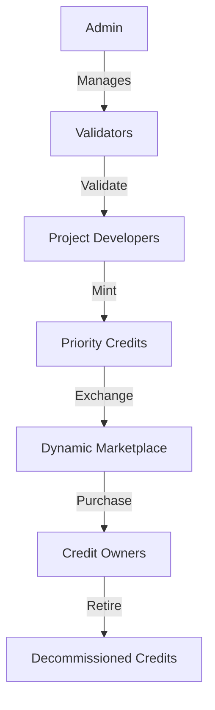

# Speed Priority: Ultra-Fast Carbon Credit Exchange

A high-velocity, transparent marketplace for carbon credits on the Stacks blockchain. Speed Priority enables rapid verification, minting, and trading of carbon credits, providing an agile platform for offsetting carbon footprints with unprecedented efficiency.

## Overview

Speed Priority revolutionizes carbon credit management through a lightning-fast smart contract system that:
- Accelerates carbon credit validation and minting
- Creates a dynamic, real-time marketplace for credit trading
- Enables instant retirement of credits for immediate carbon offsetting
- Maintains a rapid, immutable record of all transactions

### Key Features
- Ultra-fast project developer validation
- Rapid carbon credit minting with comprehensive metadata
- High-speed peer-to-peer credit trading
- Real-time marketplace listings
- Instant credit retirement mechanism
- Advanced market metrics tracking

## Architecture

The system leverages a cutting-edge smart contract designed for maximum performance and transparency.



### Core Components
1. **Rapid Governance**: Quick admin management of validators
2. **Swift Verification**: Validators rapidly approve project developers
3. **Priority Credit Registry**: High-performance tracking of carbon credits
4. **Dynamic Marketplace**: Instant listing and trading capabilities
5. **Accelerated Retirement**: Immediate offset claim recording

## Contract Documentation

### Core Functionality

#### Access Control
- `contract-admin`: High-speed administrator
- `authorized-validators`: Rapid verification entities
- `verified-developers`: Quickly registered credit generators

#### Priority Credits
Each credit contains:
- Accelerated developer identification
- Precise carbon offset volume
- Comprehensive project metadata
- Instant vintage and reference tracking
- Real-time retirement status

#### Dynamic Marketplace
Supports:
- Lightning-fast credit listings
- Instant peer-to-peer transfers
- Rapid purchase mechanisms
- Flexible listing management

## Getting Started

### Prerequisites
- Clarinet
- Stacks wallet
- Testnet STX tokens

### Basic Usage

1. **Minting Credits**
```clarity
(contract-call? .priority-credit list-credits-for-sale
    u100 ; volume
    "Renewable Energy" ; project-category
    "Global South" ; geographic-region
    u2024 ; credit-year
)
```

2. **Creating Marketplace Offer**
```clarity
(contract-call? .priority-credit list-credits-for-sale
    u1 ; credit-id
    u50 ; volume
    u1000000 ; unit-price (microSTX)
)
```

3. **Withdrawing Listing**
```clarity
(contract-call? .priority-credit withdraw-listing u1)
```

## Development

### Testing
```bash
clarinet test
```

### Local Development
1. Clone repository
2. `clarinet requirements`
3. `clarinet start`

## Security Considerations

### Key Safeguards
- Multi-tier authorization
- Rapid developer validation
- Instantaneous balance verification
- Robust anti-double-counting mechanisms

### Performance Considerations
- Designed for high-throughput environments
- Minimized computational overhead
- Efficient state management